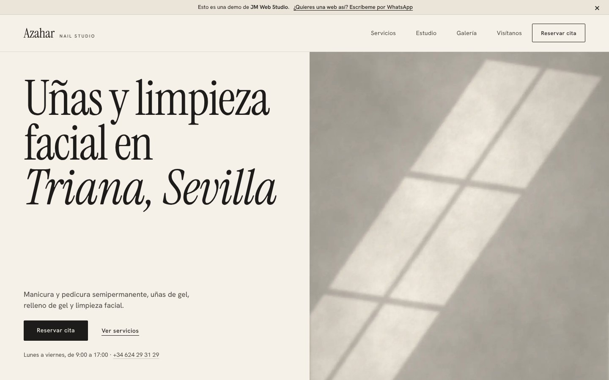
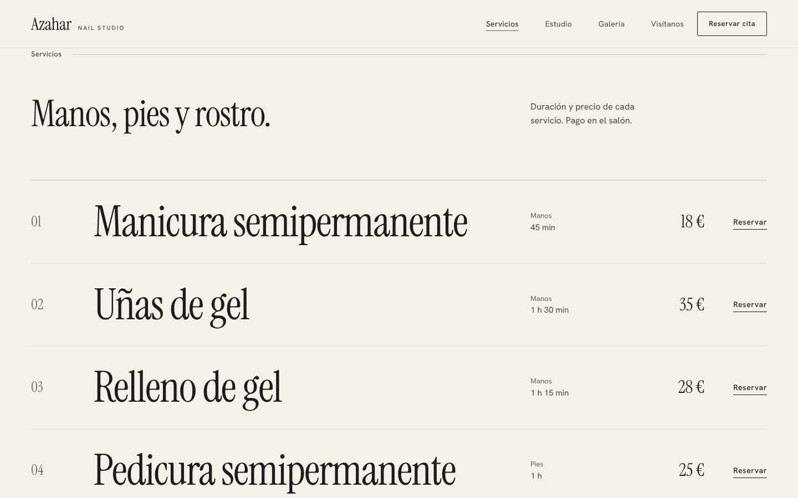

# Azahar Nail Studio

Web de un estudio de uñas y estética en **Triana, Sevilla**, con **reservas online integradas mediante Cal.com**. Es una web estática (HTML, CSS y JavaScript sin frameworks), pensada para ser rápida, accesible y fácil de mantener, y preparada para desplegarse en Netlify.

> **Estado: web de demostración de JM Web Studio.** El negocio es ficticio: el nombre y el barrio son de ejemplo. Los servicios, precios, duraciones, horario y enlace de reservas son los configurados en la cuenta de Cal.com de la demostración. Los datos legales del titular aparecen marcados como *pendientes* porque no existen; no se han inventado.
>
> **Las cinco fotografías son provisionales** (estudios de luz generados por código, sin personas ni productos). Hay que sustituirlas por fotografía real del negocio: ver [Fotografía](#fotografía-real-cómo-sustituir-los-placeholders).

| Escritorio | Móvil |
| --- | --- |
|  |  |
|  | [Página completa en móvil](docs/screenshots/mobile-pagina-completa.jpg) |

## Qué resuelve

Una persona llega desde Google o Instagram y necesita saber, en pocos segundos, **qué ofrece el salón, cuánto cuesta, cuánto dura, dónde está y cómo reservar**. La portada da la acción principal (*Reservar cita*) sin hacer scroll en un portátil de 1366×768, la carta de servicios muestra duración y precio de cada uno con su propio botón de reserva, y el calendario está a un toque desde cualquier punto.

## Funcionalidades

- **Reservas con Cal.com** integradas en la página (embed en línea). Cada servicio tiene su botón *Reservar*, que selecciona su evento de Cal.com y lleva el foco al selector de servicio; los selectores permiten cambiar de servicio sin salir de la página.
- **Carta de servicios** como lista editorial: nombre, duración y precio discretos y un *Reservar* por fila.
- **Contacto directo**: WhatsApp con mensaje prellenado, teléfono (`tel:`), enlace a Google Maps y horario con indicador «abierto ahora» calculado en hora de Madrid.
- **Móvil primero**: menú accesible anclado bajo la cabecera, portada con la foto arriba y la acción debajo, y barra fija con *Reservar*, WhatsApp y llamada que aparece cuando el botón de la portada sale de pantalla.
- **Privacidad por defecto**: el calendario de Cal.com y el mapa de Google **no se cargan hasta que la persona acepta** (banner con *Aceptar* y *Rechazar* de igual peso, panel de configuración y recuadros con alternativa sin cookies). Si se retira el permiso de algo ya cargado, la página se recarga para descargarlo. Si Cal.com no carga, se ofrece el enlace directo.
- **SEO local**: `title` y `description` únicos, un H1 por página, Open Graph, `canonical`, datos estructurados `BeautySalon` (con acción de reserva y catálogo de precios) coherentes con el contenido visible, `robots.txt` y `sitemap.xml` generados en el build.
- **Accesibilidad**: HTML semántico, enlace «saltar al contenido», foco visible (y no tapado por la cabecera fija), navegación por teclado, contraste AA verificado por test, soporte básico de contraste forzado y respeto de `prefers-reduced-motion`.
- **Páginas legales**: aviso legal, política de privacidad y de cookies, más una 404.

## Dirección de arte

Editorial de belleza contemporánea: **la fotografía y la tipografía son el diseño**. Se evita deliberadamente cualquier decoración temática (sin motivos de uñas ni flores, iconos, patrones, tarjetas con sombra, degradados, cristal ni bordes muy redondeados).

- **Color**: marfil, arena y negro suave. Un único acento (*bronce*) reservado a estados de interacción (hover, subrayados, indicador «abierto»). Pie oscuro cálido. Tokens en `:root` de `src/assets/css/styles.css`.
- **Tipografía**: *Instrument Serif* (titulares, números y precios; cursiva solo en «Triana, Sevilla») + *Hanken Grotesk* (interfaz y texto), autoalojadas en `woff2` (subconjunto latino).
- **Estructura**: retícula de 12 columnas con ritmo variado: portada asimétrica con foto a sangre, carta de servicios en filas, estudio con foto a sangre a la izquierda, galería escalonada, reserva en banda arena, ubicación y pie con marca grande.
- **Línea y forma**: hairlines de 1 px como único recurso gráfico, botones planos con radio de 2 px.
- **Movimiento**: solo fundidos y desplazamientos cortos al hacer scroll. Con «reducir movimiento» desaparecen las entradas animadas, los desplazamientos y el scroll suave. La portada no depende de JavaScript para verse.
- **Sin contenido inventado**: no hay testimonios, años de experiencia, certificaciones ni descripciones de proceso. Un test impide que reaparezcan frases típicas de relleno. La sección *Estudio* es deliberadamente corta hasta que el cliente aporte su historia real.

## Decisiones técnicas

- **Sin dependencias en producción**: JavaScript en una IIFE (sin módulos), sin librerías. Los únicos recursos externos son Cal.com y Google Maps, y solo tras consentimiento.
- **Build propio de unas 90 líneas** (`scripts/build.mjs`, sin paquetes): sustituye la URL pública en `canonical`/Open Graph/Schema, añade un hash de contenido a CSS y JS (caché larga sin riesgo de ficheros obsoletos) y genera `robots.txt` y `sitemap.xml`. Mientras `INDEXABLE` no sea `true` mantiene `noindex` (la 404 lo conserva siempre), porque es una demostración.
- **Reserva real, no simulada**: se usa el snippet oficial de Cal.com. En los tests se sustituye `embed.js` por un doble local para verificar la integración sin red.
- **Peso** (sin comprimir, medido en el build): HTML 22 KB, CSS 35 KB, JS 20 KB, fuentes 78 KB (3 `woff2`) y 16 KB la foto de portada: unos 170 KB para la primera pantalla móvil. Las demás fotografías se cargan en diferido. No se ha medido con Lighthouse.

## Tecnologías

HTML5 · CSS3 (variables, grid) · JavaScript (ES5/ES2015, sin transpilar) · Node.js ≥ 20.12 para los scripts · Netlify (alojamiento) · Cal.com y Google Maps (embeds).
Herramientas de desarrollo: [Playwright](https://playwright.dev) y [html-validate](https://html-validate.org).

## Estructura

```
src/                       Código fuente de la web (lo que se publica)
  index.html               Portada: hero, servicios, estudio, galería, reservas y contacto
  aviso-legal.html · politica-privacidad.html · politica-cookies.html · 404.html
  assets/css/styles.css    Tokens, componentes, secciones y responsive
  assets/js/main.js        Menú, consentimiento, Cal.com, mapa, barra móvil, «abierto ahora»
  assets/fonts/            Instrument Serif y Hanken Grotesk (woff2, licencia SIL OFL)
  assets/img/              Favicon, icono iOS e imagen para compartir
  assets/img/photos/       Fotografías (hoy, placeholders): portada, estudio y galería
scripts/
  build.mjs                Compila src/ a dist/ (SITE_URL, hash de caché, robots, sitemap)
  dev.mjs · serve.mjs      Servidor local con recompilación
  brand-assets.mjs         Regenera favicon PNG, icono iOS e imagen Open Graph
  screenshots.mjs          Regenera docs/screenshots/
tests/                     Pruebas automáticas (Node test runner + Playwright)
netlify.toml · .env.example · .gitignore · .htmlvalidate.json
```

## Desarrollo

Requisitos: Node.js ≥ 20.12.

```bash
npm install                      # herramientas de desarrollo
npx playwright install chromium  # solo la primera vez, para los tests
npm run dev                      # http://localhost:8765 (compila y recompila al guardar)
npm run build                    # genera dist/ (necesita SITE_URL, ver abajo)
npm run validate                 # valida el HTML
npm test                         # 97 pruebas: build, contraste, consola, enlaces, SEO, reservas, móvil, teclado
npm run screenshots              # actualiza docs/screenshots/
```

Los tests comprueban, en Chromium real y en cinco anchos (360 a 1920 px): ausencia de errores de consola y de peticiones fallidas, ausencia de desbordes horizontales, enlaces y anclas, SEO básico, que el Schema.org coincide con el contenido, que la web muestra exactamente los datos de `tests/business.json`, el flujo de consentimiento y de reserva por servicio (con doble local de Cal.com), el menú móvil, el foco de teclado, un presupuesto de peso y regresiones de la revisión de diseño (portada dentro del pliegue en portátiles, precio y *Reservar* separados en tablet, portada visible sin JavaScript, selectores de servicio visibles tras *Reservar*, retirada del consentimiento, orden del DOM, etc.).

## Configuración

Se define en variables de entorno (ver [`.env.example`](.env.example)). No hay secretos: todo el contenido es público.

| Variable | Uso |
| --- | --- |
| `SITE_URL` | URL pública, sin barra final. Netlify la aporta como `URL`, así que allí no hace falta. |
| `INDEXABLE` | `false` (por defecto): demostración, con `noindex` y `Disallow`. `true`: permite indexar y genera `sitemap.xml`. |
| `PORT` | Puerto del servidor local (por defecto 8765). |

## Despliegue en Netlify

1. Conectar el repositorio. `netlify.toml` ya define el comando (`node scripts/build.mjs`) y el directorio de publicación (`dist`).
2. Para una web real, añadir `INDEXABLE=true` en las variables de entorno del sitio y asociar el dominio.

Las cabeceras de seguridad y la caché están en `netlify.toml`. CSS, JS y fuentes se cachean un año; las imágenes se revalidan en cada visita a propósito, para que al sustituir los placeholders no quede la foto antigua en el navegador. No se ha definido una política `Content-Security-Policy` porque el calendario de Cal.com no se pudo probar contra ninguna política concreta durante el desarrollo.

## Fotografía real: cómo sustituir los placeholders

Hay cinco imágenes en `src/assets/img/photos/`. Para cada una, reemplazar el archivo manteniendo el nombre (o cambiar la ruta en `src/index.html`), exportar en WebP o AVIF y actualizar `width`/`height`.

| Archivo | Dónde sale | Proporción | Notas |
| --- | --- | --- | --- |
| `portada.webp` | Portada (imagen LCP) | Vertical, 4:5 recomendada | Se recorta entre ~2:3 y 1:1 según la pantalla: el motivo debe quedar centrado. |
| `estudio.webp` | Sección *Estudio* | 3:2 | Foto real del local. |
| `galeria-1.webp` | Galería | 4:5 | |
| `galeria-2.webp` | Galería | 1:1 | |
| `galeria-3.webp` | Galería | 4:3 | |

En cada ``: quitar `data-placeholder`, escribir un `alt` descriptivo (los placeholders llevan `alt=""` porque son decorativos) y mantener `fetchpriority="high"` solo en la portada y `loading="lazy"` en el resto. Mientras queden placeholders, `npm test` muestra un aviso. Hace falta permiso o autoría de las fotos; no se deben usar imágenes de stock presentadas como del negocio.

## Mantenimiento: dónde cambiar cada cosa

| Qué | Dónde |
| --- | --- |
| Servicios, precios y duraciones | `src/index.html` (carta, selectores, `data-cal-link`, JSON-LD) y `tests/business.json`. Deben coincidir con los eventos de Cal.com. |
| Usuario de Cal.com | `data-cal-link`, `data-cal-base`, `data-cal-origin` en `src/index.html`. |
| Horario | Tabla de contacto, línea de la portada, `data-*` de `#open-now` y JSON-LD. |
| Teléfono y WhatsApp | Buscar y reemplazar el número en `src/` (enlaces `tel:` y `wa.me`) y en `tests/business.json`. |
| Mapa | `data-src` de `#map-wrap` en `src/index.html`. |
| Colores, tipografías y espaciado | Variables `:root` de `src/assets/css/styles.css`. |
| Datos legales | Campos marcados como *Pendiente* en `aviso-legal.html` y `politica-privacidad.html`. |
| Texto de *Estudio* | `src/index.html`: sustituir por la historia real del negocio cuando exista. |
| Quitar el modo demostración | Eliminar `#demo-bar` (HTML y su lógica en `main.js`) y desplegar con `INDEXABLE=true`. |

## Límites conocidos

- Verificado únicamente en Chromium. No se ha probado en Safari ni en Firefox, ni con lectores de pantalla.
- El calendario real de Cal.com y el mapa de Google no se pudieron cargar durante el desarrollo (sin salida a internet); la integración se verificó con un doble de `embed.js`.
- Los enlaces externos (Cal.com, Google, AEPD, Netlify) no se han podido comprobar en vivo.
- Las cinco fotografías son provisionales (ver arriba).
- El evento *Limpieza facial* de Cal.com puede seguir configurado con una duración distinta de los 45 min que muestra la web: debe coincidir en la cuenta de Cal.com.
- Los textos legales son orientativos y deben revisarlos un profesional antes de publicar una web real.

## Licencias

Sin licencia de código abierto declarada para el código del proyecto. Tipografías *Instrument Serif* y *Hanken Grotesk*: SIL Open Font License 1.1. Fotografías provisionales: generadas por código para este proyecto.
